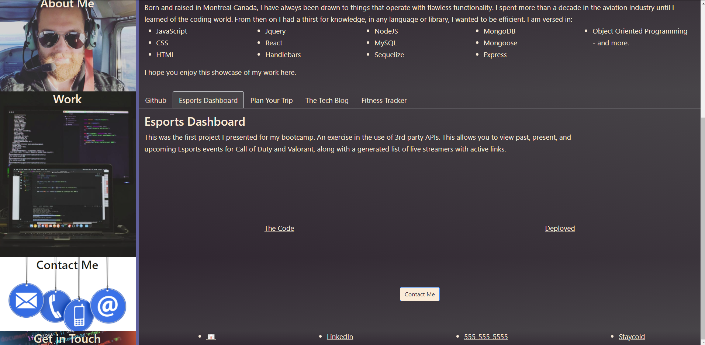

# Portfolio

<h2>This is my Portfolio: </h2>

<ul>

<li>AS AN employer looking for candidates with experience building single-page applications</li>
<li>I WANT to view a potential employee's deployed React portfolio of work samples
SO THAT I can assess whether they're a good candidate for an open position</li>

  </ul>

# Table of Contents

*[What is asked.](#criteria)

*[Intel](#links)

*[Ain't she a beauty](#screenshots)

# Criteria: 
<ul>

<li>GIVEN a single-page application portfolio for a web developer</li>
<li>WHEN I load the portfolio
THEN I am presented with a page containing a header, a section for content, and a footer</li>
<li>WHEN I view the header
THEN I am presented with the developer's name and navigation with titles corresponding to different sections of the portfolio</li>
<li>WHEN I view the navigation titles
THEN I am presented with the titles About Me, Portfolio, Contact, and Resume, and the title corresponding to the current section is highlighted</li>
<li>WHEN I click on a navigation title
THEN I am presented with the corresponding section below the navigation without the page reloading and that title is highlighted</li>
<li>WHEN I load the portfolio the first time
THEN the About Me title and section are selected by default</li>
<li>WHEN I am presented with the About Me section
THEN I see a recent photo or avatar of the developer and a short bio about them</li>
<li>WHEN I am presented with the Portfolio section
THEN I see titled images of six of the developer’s applications with links to both the deployed applications and the corresponding GitHub repositories</li>
<li>WHEN I am presented with the Contact section
THEN I see a contact form with fields for a name, an email address, and a message</li>
<li>WHEN I move my cursor out of one of the form fields without entering text
THEN I receive a notification that this field is required</li>
<li>WHEN I enter text into the email address field
THEN I receive a notification if I have entered an invalid email address</li>
<li>WHEN I am presented with the Resume section
THEN I see a link to a downloadable resume and a list of the developer’s proficiencies</li>
<li>WHEN I view the footer
THEN I am presented with text or icon links to the developer’s GitHub and LinkedIn profiles, and their profile on a third platform (Stack Overflow, Twitter)</li>

</ul>

# Links:

<h3>Github</h3>
<a href="https://github.com/Staycold/portfolio" target="_blank">https://github.com/Staycold/portfolio</a>

<h3>Github Pages</h3>
<a href="https://staycold.github.io/portfolio/" target="_blank">https://staycold.github.io/portfolio/ </a>

 

# screenshots

